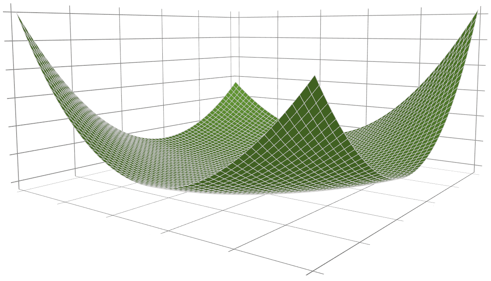

[](https://github.com/bgrimstad/splinter/releases)
[]()

| **`Master branch`** | **`Develop branch`** |
|-----------------|---------------------|
| [](https://travis-ci.org/bgrimstad/splinter) | [](https://travis-ci.org/bgrimstad/splinter) |

## SPLINTER
SPLINTER (SPLine INTERpolation) is a library for *multivariate function approximation with splines*. The library can be used for function approximation, regression, data smoothing, data reduction, and much more. Spline approximations are represented by a speedy C++ implementation of the tensor product B-spline.

The B-spline consists of piecewise polynomial basis functions, offering a high flexibility and smoothness. The B-spline can be fitted to data using ordinary least squares (OLS), possibly with regularization. The library also offers construction of penalized splines (P-splines).


Figure: Illustration of a bicubic B-spline generated with the SPLINTER library.

### Sharing
SPLINTER is the result of several years of development towards a fast and general library for multivariate function approximation. The initial intention with the library was to build splines for use in mathematical programming (nonlinear optimization). Thus, some effort has been put into functionality that supports this, e.g. Jacobian and Hessian computations for the B-spline.

By making SPLINTER publicly available we hope to help anyone looking for a multivariate function approximation library. In return, we expect nothing but your suggestions, improvements, and feature requests. If you use SPLINTER in a scientific work we kindly ask you to cite it. You can cite it as shown in the bibtex entry below (remember to update the date accessed).
```
@misc{SPLINTER,
  title={{SPLINTER: a library for multivariate function approximation with splines}},
  author={Bjarne Grimstad and others},
  howpublished={\url{http://github.com/bgrimstad/splinter}},
  year={2015},
  note={Accessed: 2015-05-16}
}
```
### Contributing
Everyone is welcome to use and contribute to SPLINTER. We believe that collective effort over time is the only way to create a great library: one that makes multivariate function approximation with splines more accessible to practitioners and researchers.

The current goals with the library are:

1. To make the library more accessible by improving the interfaces and documentation
2. To implement new features
3. To improve the current code via testing

The simplest way to contribute to SPLINTER is to use it and give us feedback on the experience. If you would like to contribute by coding, you can get started by picking a suitable issue from the [list of issues](https://github.com/bgrimstad/splinter/issues). The issues are labeled with the type of work (`Bug`, `Docs`, `Enhancement`, `New feature`, `Refactoring`, `Tests`) and level of difficulty (`Beginner`, `Intermediate`, `Advanced`). Some issues are also labeled as `Critical`, which means that they deserve our attention and prioritization.

### Requirements for use
A standards compliant C++11 compiler.

### Guides
* [Basic usage](docs/basic_usage.md)
* [C++ interface](docs/cpp_interface.md)
* [MatLab interface](docs/matlab_interface.md)
* [Python interface](docs/python_interface.md)
* [C interface](docs/c_interface.md)
* [Compilation](docs/compile.md)
